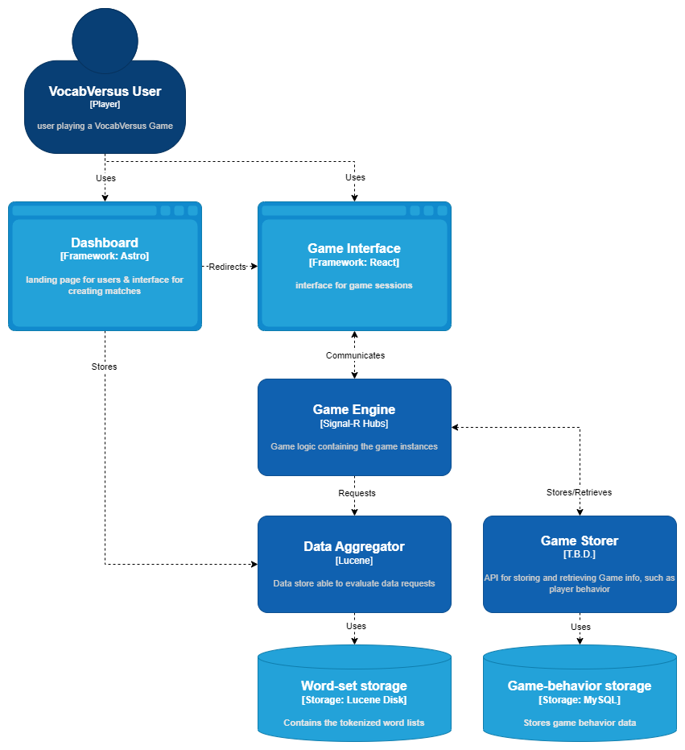

# VocabVersus
**VocabVersus** is a **web-based** multiplayer vocabulary game, in this game multiple players will compete to think of a word containing given letters. 
Points will be given based on **player’s speed** and **complexity** of the word given, along with the **popularity of the given word**.

## Similar Contexts
Similar games based on creating/guessing words already exist such as [Scrabble](https://playscrabble.com/) or [Wordle](https://www.nytimes.com/games/wordle/index.html) and games such as [scribble.io](https://skribbl.io/) is similar in its functionality/behavior.

## Roadmap
- [x] Dashboard / Landing page
	- [x] Game Creator
	- [x] Customize game rules 
	- [ ] WordSet importer
- [ ] Game Interface
	- [x] Realtime game connectivity
	- [x] Game instance joining
	- [x] Gameplay
		- [x] Pre start lobby
		- [x] Player management
		- [x] Session storing
		- [x] Match Session
			- [x] Letter showcase
			- [x] Input feedback
			- [x] Event feedback
		- [ ] Player activated events
- [ ] Game Engine
	- [x] Game instance initializer
	- [x] System for receiving game input and returning game information
	- [x] Player connection system handling player - game instance communication
	- [x] Persistent player sessions
	- [x] Word Aggregation connection
	- [x] Game instance password protection
	- [x] Match session handler
		- [x] Event handler 
- [ ] Game data storage
	- [ ] Word usage tracker
- [x] Word Aggregation
	- [x] WordSet storage
	- [x] WordSet info querying
	- [x] Word finder/evaluator
- [x] Deployment pipeline
	- [x] Automated CI/CD
	- [x] Cloud Deployment

## Diagrams

## Cloud Hosts
